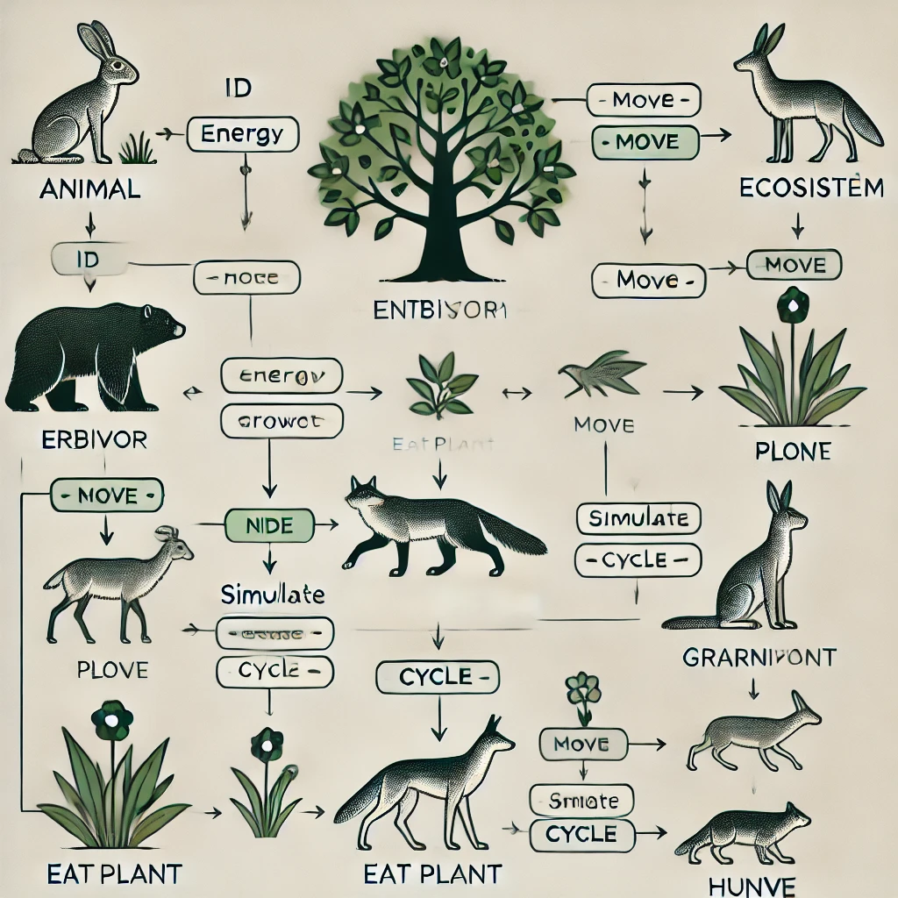

# Ecosystem Simulation README

## 1. Class Descriptions and Hierarchies

### **Class: `EntitateEcosistem` (Base class for all ecosystem entities)**

- **Attributes:**
  - `nume`: Name of the entity.
  - `energie`: Energy level of the entity.
  - `rataSupravietuire`: Survival rate of the entity.
  - `x, y`: Position coordinates of the entity in the ecosystem.

- **Methods:**
  - `getNume()`: Returns the name of the entity.
  - `getEnergie()`: Returns the energy of the entity.
  - `mananca()`: A pure virtual method that must be implemented in derived classes.
  - `scadeEnergie()`: Reduces the entity's energy by a specified value.
  - `muta()`: Changes the entity’s position in the ecosystem.
  - `afiseaza()`: Displays details about the entity.

### **Class: `Animal` (Derived from `EntitateEcosistem`)**

- **Description:** 
  - An abstract class representing an animal. Implements methods for `mananca()` and `reproduce()`.

### **Class: `Planta` (Derived from `EntitateEcosistem`)**

- **Description:** 
  - Represents a plant that cannot eat other entities. Includes a method for reproduction that generates a new plant.

### **Class: `Erbivor` (Derived from `Animal`)**

- **Description:**
  - Represents an herbivore that can eat plants. It has a reproduction behavior, generating a new herbivore.

### **Class: `Carnivor` (Derived from `Animal`)**

- **Description:**
  - Represents a carnivore that can eat other animals. It has a reproduction behavior, generating a new carnivore.

### **Class: `Ecosistem`**

- **Description:**
  - Represents the ecosystem where entities live.
  
- **Attributes:**
  - `entitati`: A list of entities in the ecosystem.
  - `jurnalInteractiuni`: A log of interactions between entities.

- **Methods:**
  - `adaugaEntitate()`: Adds an entity to the ecosystem.
  - `simuleaza()`: Displays the current state of the ecosystem.
  - `atac()`: Allows interaction between two entities (e.g., an attack).
  - `reproducere()`: Allows the reproduction of an entity.
  - `genereazaEvenimentAleator()`: Generates random events like storms or droughts.
  - `genereazaRaport()`: Displays a final report of the ecosystem and its interactions.

## 2. Method Explanations

### **Methods from `EntitateEcosistem`:**
- `getNume()`: Returns the entity’s name.
- `getEnergie()`: Returns the energy level of the entity.
- `mananca()`: A pure virtual method that must be implemented by derived classes (plants do not implement it).
- `scadeEnergie()`: Decreases the entity’s energy by a specified amount.
- `muta()`: Changes the entity’s position by updating its `x` and `y` coordinates.
- `afiseaza()`: Displays the entity’s details (name, energy, position, survival rate).

### **Methods from `Animal`:**
- `mananca()`: Allows the animal to eat another entity (herbivores eat plants, carnivores eat other animals).
- `reproduce()`: Creates an instance of a baby animal (either an herbivore or carnivore, depending on the class).

### **Methods from `Planta`:**
- `mananca()`: Does nothing, as plants do not eat.
- `reproduce()`: Creates a new plant with random energy and position coordinates.

### **Methods from `Erbivor` and `Carnivor`:**
- `mananca()`: Implemented for herbivores (which eat plants) and carnivores (which eat animals).
- `reproduce()`: Creates a baby herbivore or carnivore and adds it to the ecosystem.

### **Methods from `Ecosistem`:**
- `adaugaEntitate()`: Adds an entity to the ecosystem.
- `simuleaza()`: Displays all current entities and their details.
- `atac()`: Allows interaction between two entities, such as an attack between a carnivore and its prey.
- `reproducere()`: Allows reproduction of an entity, adding the resulting offspring to the ecosystem.
- `genereazaEvenimentAleator()`: Generates a random event (storm, drought, attack).
- `genereazaRaport()`: Displays a final ecosystem report, showing the number of plants, herbivores, carnivores, and interaction log.

## 3. UML Diagram

## 4. Use Case Scenarios

### **Example 1: Adding an entity to the ecosystem**
A plant named "Planta1" is created with 50 energy, a survival rate of 0.9, and positioned at (0, 0). The ecosystem adds this plant to its entity list and simulates the ecosystem.

### **Example 2: An attack between an herbivore and a plant**
An herbivore "Iepure" with 30 energy and a plant "Mărul" with 20 energy are added to the ecosystem. The herbivore interacts with the plant, eating it and gaining energy.

### **Example 3: Reproduction of a carnivore**
A carnivore "Lupul" reproduces, generating a baby carnivore with 15 energy and a random position in the ecosystem.

## 5. Challenges Encountered and Adopted Solutions

### **Managing Random Events:**
A challenge was handling random events such as storms or droughts. To solve this, a function was implemented that generates a random number to determine the event.

### **User Input Validation:**
To prevent invalid entity selection during attacks or reproduction, input validation was implemented to ensure that only valid indices are chosen.